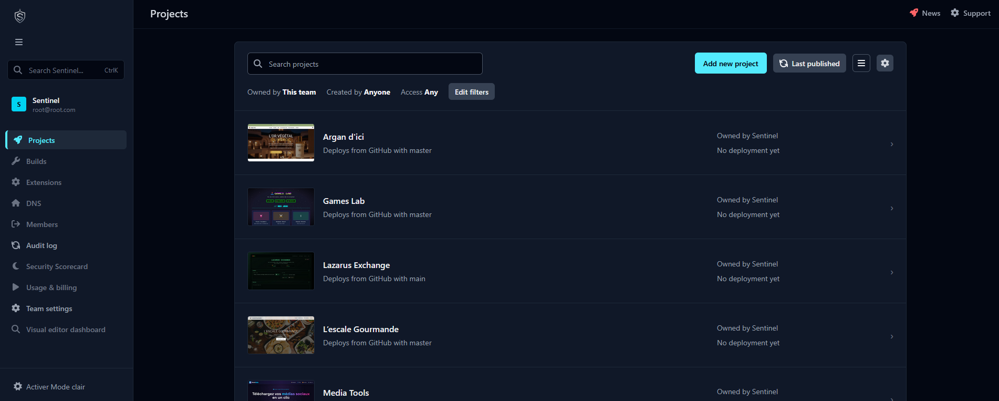

<a name="readme-top"></a>

<!-- PROJECT SHIELDS -->
[![Contributors][contributors-shield]][contributors-url]
[![Forks][forks-shield]][forks-url]
[![Stargazers][stars-shield]][stars-url]
[![Issues][issues-shield]][issues-url]
[![License][license-shield]][license-url]
[![LinkedIn][linkedin-shield]][linkedin-url]


<!-- TABLE OF CONTENTS -->
<details>
  <summary>Table of Contents</summary>
  <ol>
    <li>
      <a href="#about-the-project">About The Project</a>
      <ul>
        <li><a href="#️-description">Description</a></li>
        <li><a href="#-mvp-scope">MVP Scope</a></li>
        <li><a href="#-planned-features">Planned Features</a></li>
        <li><a href="#️-built-with">Built With</a></li>
      </ul>
    </li>
    <li>
      <a href="#-getting-started">Getting Started</a>
      <ul>
        <li><a href="#-installation">Installation</a></li>
        <li><a href="#-docker">Docker</a></li>
        <li><a href="#️-usage">Usage</a></li>
        <li><a href="#-local-notes">Local Notes</a></li>
        <li><a href="#-deploysh-contract">deploy.sh Contract</a></li>
        <li><a href="#-scripts">Scripts</a></li>
      </ul>
    </li>
    <li><a href="#-contributing">Contributing</a>
      <ul>
        <li><a href="#-license">License</a></li>
        <li><a href="#-contact">Contact</a></li>
      </ul>
    </li>
  </ol>
</details>


<!-- ABOUT THE PROJECT -->
# 🧠 About The Project

<p align="center">
  <a href="https://github.com/nlabrazi/sentinel">
    
  </a>
</p>


<!-- DESCRIPTION -->
### ℹ️ Description

Sentinel is a personal DevOps control panel inspired by Netlify, built to monitor and operate Docker projects deployed on a VPS.

It is not designed to replace Grafana, Loki, SSH, or the terminal. Its goal is to centralize common project operations in a simple, stable, and readable Rails interface.

- 📦 Project Inventory: List all deployed projects from a single dashboard.
- 🚦 Health Status: Track simple online/offline/unknown project states.
- 🔁 Deployment Flow: Trigger standardized VPS deploy scripts through SSH.
- 🧾 Deploy History: Keep deployment status, duration, commit SHA, and logs.
- 🔗 GitHub Sync: Compare deployed commits with the configured GitHub branch.
- 🔐 Safe Operations: Run predefined commands only, never arbitrary shell commands from the UI.

---

## 🎯 MVP Scope

Sentinel focuses on a small and reliable first version:

- Dashboard with projects, health state, commit drift, and latest deployment.
- Project page with production URL, VPS path, deploy action, maintenance mode, and deployment history.
- GitHub API integration for branch commit status.
- SSH execution against a restricted VPS user.
- Standardized project layout under `/srv/apps/<project>`.
- Standardized deployment entrypoint through `/srv/apps/<project>/deploy.sh`.

Sentinel intentionally does not manage Docker containers directly from arbitrary UI commands.

---

## 🚀 Planned Features

- 📊 Reliable Dashboard: Improve global visibility across all VPS projects.
- 🧪 Healthchecks: Add simple and explicit HTTP healthcheck history.
- 🧾 Deploy Logs: Improve deployment log readability and failure diagnosis.
- 🔄 GitHub Sync: Keep commit drift updated on a recurring schedule.
- 🔐 SSH Hardening: Keep the SSH execution surface limited to known project operations.
- ⏱️ Cron Monitoring: Track recurring project jobs and last execution status.
- 📣 Notifications: Send important deployment or health alerts to Telegram.
- 🧰 Maintenance Mode: Standardize project maintenance toggling.
- 📈 Observability Links: Link to existing Grafana/Loki dashboards instead of replacing them.

---


### 🏗️ Built With

* [![Ruby][Ruby.js]][Ruby-url]
* [![Rails][Rails.js]][Rails-url]
* [![PostgreSQL][PostgreSQL.js]][PostgreSQL-url]
* [![Hotwire][Hotwire.js]][Hotwire-url]
* [![Stimulus][Stimulus.js]][Stimulus-url]
* [![TailwindCSS][TailwindCSS.js]][TailwindCSS-url]
* [![Docker][Docker.io]][Docker-url]
* [![Caddy][Caddy.js]][Caddy-url]

<p align="right">(<a href="#readme-top">back to top</a>)</p>


<!-- GETTING STARTED -->
# ✅ Getting Started

This project is a Ruby on Rails application running on `http://localhost:3000` through Docker Compose.

### 💻 Installation

```bash
# Clone the repository
git clone git@github.com:nlabrazi/sentinel.git
cd sentinel

# Copy environment variables
cp .env.example .env
```

Fill the required values in `.env` when you need GitHub, SSH, or screenshot integrations.

### 🐳 Docker

```bash
# First start, or after dependency/Dockerfile changes
docker compose up --build

# Regular start
docker compose up
```

The Rails container mounts the project directory into `/app`, so code changes are reflected inside the running application.

### ▶️ Usage

1. Open `http://localhost:3000`
2. Sign in with the configured admin user
3. Review project status from the dashboard
4. Open a project page
5. Trigger a deployment when the project needs to be updated
6. Review deployment history and logs

### 🔧 Local Notes

- The canonical test environment is Docker Compose.
- PostgreSQL runs through the `sentinel-db` service.
- Background jobs run with Rails Active Job and Solid Queue.
- GitHub API access requires `GITHUB_TOKEN`.
- SSH execution requires `VPS_HOST`, `VPS_USER`, and `SSH_KEY_PATH`.
- Screenshots are optional and require `APIFLASH_ACCESS_KEY`.

### 📜 deploy.sh Contract

Each managed project should expose a deployment script at:

```bash
/srv/apps/<project>/deploy.sh
```

The script must:

- Be executable by the configured VPS SSH user.
- Run without interactive prompts.
- Return exit code `0` on success.
- Return a non-zero exit code on failure.
- Write useful output to stdout and stderr.
- Keep project-specific deployment logic inside the project directory.

Sentinel only calls this predefined script. It does not accept arbitrary commands from the web interface.

### 🧪 Scripts

```bash
# Run the application stack
docker compose up

# Run the full CI suite inside the Rails container
docker compose exec sentinel-api bin/ci

# Open a Rails console
docker compose exec sentinel-api bin/rails console

# Run database migrations
docker compose exec sentinel-api bin/rails db:migrate

# Seed local data
docker compose exec sentinel-api bin/rails db:seed
```

<p align="right">(<a href="#readme-top">back to top</a>)</p>


<!-- CONTRIBUTING -->
# 🙌 Contributing

This is a personal control panel, but improvements should stay aligned with the product goal: simple, stable, readable, and safe VPS project operations.

To contribute:
1. 🍴 Fork the repo
2. 🔧 Create a feature branch (`git checkout -b feat/my-feature`)
3. 💬 Commit your changes (`git commit -m "feat: add my feature"`)
4. 🚀 Push to your fork (`git push origin feat/my-feature`)
5. 📬 Open a pull request

<p align="right">(<a href="#readme-top">back to top</a>)</p>


<!-- LICENSE -->
### 📄 License

No license file is currently committed.

Add a `LICENSE.txt` file before distributing or opening the project for external reuse.

<p align="right">(<a href="#readme-top">back to top</a>)</p>


<!-- CONTACT -->
### 📬 Contact

- 👤 [Linkedin][linkedin-url]
- 🐦 [@Nabil](https://twitter.com/Nabil71405502)
- 📧 na.labrazi@gmail.com
- 🔗 [Portfolio](https://nabil-labrazi.fr)
- 📁 [Project Repository](https://github.com/nlabrazi/sentinel)

<p align="right">(<a href="#readme-top">back to top</a>)</p>


<!-- MARKDOWN LINKS & IMAGES -->
[contributors-shield]: https://img.shields.io/github/contributors/nlabrazi/sentinel.svg?style=for-the-badge
[contributors-url]: https://github.com/nlabrazi/sentinel/graphs/contributors
[forks-shield]: https://img.shields.io/github/forks/nlabrazi/sentinel.svg?style=for-the-badge
[forks-url]: https://github.com/nlabrazi/sentinel/network/members
[stars-shield]: https://img.shields.io/github/stars/nlabrazi/sentinel.svg?style=for-the-badge
[stars-url]: https://github.com/nlabrazi/sentinel/stargazers
[issues-shield]: https://img.shields.io/github/issues/nlabrazi/sentinel.svg?style=for-the-badge
[issues-url]: https://github.com/nlabrazi/sentinel/issues
[license-shield]: https://img.shields.io/badge/license-pending-lightgrey?style=for-the-badge
[license-url]: https://github.com/nlabrazi/sentinel
[linkedin-shield]: https://img.shields.io/badge/-LinkedIn-black.svg?style=for-the-badge&logo=linkedin&colorB=555
[linkedin-url]: https://linkedin.com/in/nabil-labrazi
[Ruby.js]: https://img.shields.io/badge/ruby-%23CC342D.svg?style=for-the-badge&logo=ruby&logoColor=white
[Ruby-url]: https://www.ruby-lang.org/en/
[Rails.js]: https://img.shields.io/badge/rails-%23CC0000.svg?style=for-the-badge&logo=ruby-on-rails&logoColor=white
[Rails-url]: https://rubyonrails.org/
[PostgreSQL.js]: https://img.shields.io/badge/postgresql-316192?style=for-the-badge&logo=postgresql&logoColor=white
[PostgreSQL-url]: https://www.postgresql.org/
[Hotwire.js]: https://img.shields.io/badge/hotwire-F04A23?style=for-the-badge&logo=hotwire&logoColor=white
[Hotwire-url]: https://hotwired.dev/
[Stimulus.js]: https://img.shields.io/badge/stimulus-0a0a0a?style=for-the-badge&logo=stimulus&logoColor=white
[Stimulus-url]: https://stimulus.hotwired.dev/
[TailwindCSS.js]: https://img.shields.io/badge/tailwindcss-06B6D4?style=for-the-badge&logo=tailwindcss&logoColor=white
[TailwindCSS-url]: https://tailwindcss.com/
[Docker.io]: https://img.shields.io/badge/docker-2496ED?style=for-the-badge&logo=docker&logoColor=white
[Docker-url]: https://www.docker.com/
[Caddy.js]: https://img.shields.io/badge/caddy-1F88C0?style=for-the-badge&logo=caddy&logoColor=white
[Caddy-url]: https://caddyserver.com/
