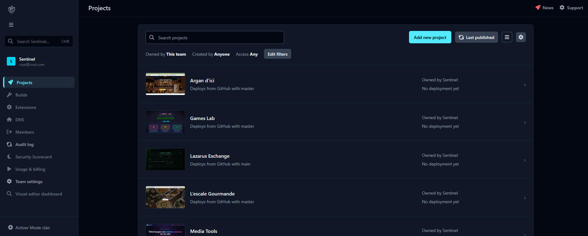

<a name="readme-top"></a>

<!-- PROJECT SHIELDS -->
[![Contributors][contributors-shield]][contributors-url]
[![Forks][forks-shield]][forks-url]
[![Stargazers][stars-shield]][stars-url]
[![Issues][issues-shield]][issues-url]
[![License][license-shield]][license-url]
[![LinkedIn][linkedin-shield]][linkedin-url]

<!-- TABLE OF CONTENTS -->
<details>
  <summary>Table of Contents</summary>
  <ol>
    <li>
      <a href="#-about-the-project">About The Project</a>
      <ul>
        <li><a href="#ℹ️-description">Description</a></li>
        <li><a href="#-core-features">Core Features</a></li>
        <li><a href="#🏗️-built-with">Built With</a></li>
      </ul>
    </li>
    <li>
      <a href="#-getting-started">Getting Started</a>
      <ul>
        <li><a href="#-installation">Installation</a></li>
        <li><a href="#-docker-compose">Docker Compose</a></li>
        <li><a href="#-first-login--seeding">First Login & Seeding</a></li>
        <li><a href="#-environment-variables-reference">Environment Variables Reference</a></li>
      </ul>
    </li>
    <li>
      <a href="#-operational-contracts--architecture">Operational Contracts & Architecture</a>
      <ul>
        <li><a href="#-deploysh-contract">deploy.sh Contract</a></li>
        <li><a href="#-statussh--cron-statusjson-contract">status.sh & cron-status.json Contract</a></li>
        <li><a href="#-quick-terminal-security-model">Quick Terminal Security Model</a></li>
        <li><a href="#-zero-reload-maintenance-mode">Zero-Reload Maintenance Mode</a></li>
        <li><a href="#-grafana--loki-embed">Grafana & Loki Embed</a></li>
        <li><a href="#-umami-analytics-v2-integration">Umami Analytics v2 Integration</a></li>
        <li><a href="#-authentik-oidc-single-sign-on">Authentik OIDC Single Sign-On</a></li>
        <li><a href="#-solid-queue--background-workers">Solid Queue & Background Workers</a></li>
      </ul>
    </li>
    <li><a href="#-cli--development-commands">CLI & Development Commands</a></li>
    <li><a href="#-testing--quality-assurance">Testing & Quality Assurance</a></li>
    <li><a href="#-contributing">Contributing</a></li>
    <li><a href="#-license">License</a></li>
    <li><a href="#-contact">Contact</a></li>
  </ol>
</details>

<!-- ABOUT THE PROJECT -->
# 🧠 About The Project

<p align="center">
  <a href="https://github.com/nlabrazi/sentinel">
    
  </a>
</p>

### ℹ️ Description

**Sentinel** is a self-hosted DevOps & project operations control panel inspired by Netlify and Vercel, designed specifically to monitor, operate, and deploy Docker-based projects running on a VPS.

It is not built to replace Prometheus, Grafana, Loki, or direct SSH access. Rather, its mission is to centralize day-to-day project operations in a clean, robust, and readable Rails interface:

-  **Project Catalog & Classification**: Monitor applications (`app`), background daemons (`service`), and scheduled workloads (`cron`).
- 🚦 **Automated Healthchecks**: Periodic HTTP checks, latency logging, response history, and runtime opt-in controls.
- 🔁 **Standardized Deployment Pipeline**: One-click deployments via SSH executing a predefined script with atomic concurrency locks and live streaming logs.
- 🧾 **Deployments Dashboard**: Global view of all deployments across projects with live KPIs, status/project filters, and full search.
- 🔗 **GitHub Synchronization & Commit Drift**: Track differences between deployed commits, production branches, and staging branches with direct comparison links.
- ⏱️ **Scheduled Tasks & Cron Supervision**: Visibility over cron jobs, last execution status, run duration, failure highlights, and execution history.
- 💻 **Interactive Quick Terminal**: In-browser diagnostic terminal with a strict whitelist of safe binaries to inspect VPS applications in real time.
- 📈 **Umami Analytics v2**: Direct visibility of 30-day visitors and pageviews from self-hosted Umami instances with auto-discovery and background sync.
- 📊 **Private Grafana Observability**: Embedded project-scoped Grafana dashboards matching UI theme without leaking credentials in URLs.
- 🛡️ **Zero-Reload Maintenance Mode**: Instant maintenance toggling on the VPS without reloading Nginx.
- 🔐 **Hardened Security & Authentik SSO**: Dual login with local Devise accounts (12+ character passwords, brute-force lockable) and 1-click Authentik OIDC SSO.
- ⚙️ **Ops Control Center**: Immediate global triggers, background worker heartbeat monitoring, and comprehensive system metrics.
- 🌐 **Internationalization (i18n)**: Full English and French language support with persistent cookie-based locale switching.

---

## ⚡ Core Features

### 📦 1. Project Management & Typology
- Each managed project has a dedicated card and detail view.
- Projects are categorized by kind:
  - `app`: Standard web applications requiring a repository URL, production URL, and HTTP healthcheck.
  - `service`: Background daemons, workers, or bots that do not expose public HTTP endpoints.
  - `cron`: Projects dedicated to scheduled batch jobs.
- Granular monitoring toggles per project:
  - `runtime_monitoring_enabled`: Opt-in or opt-out of HTTP availability checks.
  - `cron_monitoring_enabled`: Opt-in or opt-out of scheduled cron job status synchronization.

### 🔁 2. Safe SSH Deployment Pipeline
- Triggers `/srv/apps/<project>/deploy.sh` on the VPS over a hardened SSH connection.
- **Concurrency Locking**: Sentinel rejects any deployment attempt if another deployment is already running on the same project.
- Captures `stdout` and `stderr` with configurable execution timeouts (`SSH_COMMAND_TIMEOUT_SECONDS`).
- Automatically truncates excessive logs safely to preserve database performance while keeping critical failure diagnostics visible.

### 🧾 3. Centralized Deployments Hub (`/deploys`)
- Operational overview with global KPIs:
  - Total deployments count
  - Overall success rate percentage
  - Failed deployments counter
  - Average deployment duration
- Comprehensive multi-criteria filtering:
  - Filter by project
  - Filter by status (`running`, `success`, `failed`)
  - Full-text search on commit SHA or project name
- Prominent live banner whenever a deployment is actively running.
- Per-deployment log view with one-click clipboard copy and expandable drawer.

### 🔗 4. GitHub Sync & Branch Drift Detection
- Compares the deployed commit SHA against the remote production branch (`effective_production_branch`).
- **Staging Sync**: Tracks drift between `staging_branch` and `production_branch` (`ahead`, `behind`, `synced`, `diverged`).
- Direct GitHub diff links:
  - Comparison between deployed commit and production branch: `https://github.com/<repo>/compare/<deployed_sha>...<prod_branch>`
  - Comparison between production branch and staging: `https://github.com/<repo>/compare/<prod_branch>...<staging_branch>`
- Pull request inspection displaying open and merged PR counts.

### ⏱️ 5. Cron Job Supervision & Status Contract
- Reads execution status published by the project under `/srv/apps/<project>/sentinel/cron-status.json`.
- Color-coded indicators: OK (`success`), Failed (highlighted with error alert), Never run, and Not reported.
- Execution history panel tracking run timestamps, duration (in seconds), exit status, and last log output.

### 💻 6. Interactive Quick Terminal
- Embedded web console on each project show page to run fast diagnostic commands on the remote VPS.
- Strict security model enforced by `QuickCommandExecutionService`:
  - **Whitelisted Binaries Only**: `git`, `docker`, `docker-compose`, `cat`, `head`, `tail`, `grep`, `egrep`, `fgrep`, `wc`, `find`, `ls`, `diff`, `stat`, `file`, `uptime`, `df`, `free`, `ps`, `pwd`, `date`, `whoami`, `uname`.
  - **Forbidden Constructs**: Rejects `sudo`, `su`, `rm`, `kill`, `chmod`, `chown`, `curl`, `wget`, `nc`, interpreters (`python`, `ruby`, `node`, `php`, `sh`), command chaining (`;`, `&&`, `|`), redirects (`>`, `<`), and command substitutions (`$()`, `` ` ``).
  - **Zero Secret Access**: Strict rejection of paths referencing `.env`, `*.key`, `*.pem`, `id_rsa`, `credentials*.enc`, or directory traversal (`..`).
  - Command history navigation with arrow keys, 1-click suggestion chips (`docker compose ps`, `df -h`, `uptime`), and clipboard copy.

### 📈 7. Umami Analytics v2 Integration
- Direct integration with self-hosted Umami analytics instances.
- Supports Bearer JWT authentication (`UMAMI_AUTH_TOKEN`) or dynamic token generation via service account credentials (`UMAMI_USERNAME` / `UMAMI_PASSWORD`).
- Automatically resolves websites by matching `production_url` hostnames or via explicit `umami_website_id`.
- Synchronizes 30-day unique visitors, 30-day pageviews, and direct links to the public analytics dashboard.
- Background sync via `SyncUmamiJob` and on-demand sync from the project page or Ops Control Center.

### 📊 8. Embedded Grafana Dashboards
- Embeds private Grafana dashboards inside an authenticated iframe.
- Scoped dynamically per project using the `grafana_app_value` attribute (e.g. `var-app=myapp`).
- Automatically aligns theme (`dark` / `light`) with Sentinel's dark mode controller.
- Does not expose secret tokens in iframe URLs; relies on the user's active Grafana browser session.

### 🔐 9. Hardened Authentication & Authentik SSO
- **Dual Authentication**:
  - Local Devise account: Hardened with 12-character minimum passwords and the `Lockable` module to mitigate brute-force attacks.
  - Authentik Single Sign-On (OIDC): 1-click authentication via OpenID Connect with automatic account provisioning and email reconciliation.
- Public user registration is disabled by default to maintain private infrastructure access.

### ⚙️ 10. Ops Control Center (`/settings`)
- Unified 2x2 operational dashboard:
  - **Global Ops Triggers**: On-demand execution of Healthcheck, GitHub Sync, Cron Sync, and Umami Sync across all projects.
  - **Application Details**: Rails version, Ruby version, database adapter, Active Storage provider, and total project/deployment counts.
  - **Environment Variables**: Status indicators (`Configured` / `Missing`) for all external integrations without ever exposing raw secret values.
  - **Solid Queue & Background Workers**: Active worker process counts, heartbeat verification (< 5 min), failed execution counts, and recurring schedule overview.

### 🌐 11. Internationalization (i18n) & Dark Mode
- Full support for English (`en`) and French (`fr`).
- Locale switcher located in the sidebar/navigation with persistent cookie storage.
- First-class Dark Mode support toggled from the user interface.

---

### 🏗️ Built With

* [![Ruby][Ruby.js]][Ruby-url]
* [![Rails][Rails.js]][Rails-url]
* [![PostgreSQL][PostgreSQL.js]][PostgreSQL-url]
* [![Hotwire][Hotwire.js]][Hotwire-url]
* [![Stimulus][Stimulus.js]][Stimulus-url]
* [![TailwindCSS][TailwindCSS.js]][TailwindCSS-url]
* [![Docker][Docker.io]][Docker-url]
* [![Caddy][Caddy.js]][Caddy-url]
* [![Playwright][Playwright.js]][Playwright-url]

<p align="right">(<a href="#readme-top">back to top</a>)</p>

---

<!-- GETTING STARTED -->
# ✅ Getting Started

Sentinel runs as a Ruby on Rails application inside Docker Compose.

### 💻 Installation

```bash
# Clone the repository
git clone git@github.com:nlabrazi/sentinel.git
cd sentinel

# Copy the example environment variables file
cp .env.example .env
```

Review and adjust `.env` with your VPS SSH credentials, GitHub token, Authentik settings, Umami configuration, and Grafana parameters.

### 🐳 Docker Compose

```bash
# Build and boot the stack (Rails API, Web UI, and PostgreSQL database)
docker compose up --build

# Regular start in background
docker compose up -d
```

The application mounts the workspace into `/app`, allowing live code reloading during development.

### 🔑 First Login & Seeding

```bash
# Run database migrations
docker compose exec sentinel-api bin/rails db:migrate

# Seed local database (creates the initial admin account and sample projects)
docker compose exec sentinel-api bin/rails db:seed
```

Default credentials generated by `db/seeds.rb` use the values defined in `.env`:
- **Username**: `admin` (or `$ADMIN_USERNAME`)
- **Password**: Configured in `$ADMIN_PASSWORD` (minimum 12 characters)

Navigate to `http://localhost:3000` and sign in.

---

### 🔧 Environment Variables Reference

| Category | Variable | Description |
| :--- | :--- | :--- |
| **Core & Rails** | `SECRET_KEY_BASE` | Rails secret key base for session integrity (generate with `bin/rails secret`). |
| | `RAILS_LOG_LEVEL` | Application log level (`debug`, `info`, `warn`, `error`). Default: `info`. |
| **Database** | `POSTGRES_HOST` | PostgreSQL host (`sentinel-db` in Docker Compose). |
| | `POSTGRES_USER` | PostgreSQL database user. Default: `postgres`. |
| | `POSTGRES_PASSWORD` | PostgreSQL database password. Default: `postgres`. |
| **Storage** | `ACTIVE_STORAGE_SERVICE` | Storage driver: `local` (stored in `./storage`) or `cloudinary`. |
| | `CLOUDINARY_URL` | Cloudinary connection URI (when using cloud storage). |
| | `CLOUDINARY_FOLDER` | Destination folder in Cloudinary (e.g. `sentinel/development`). |
| **Screenshots** | `APIFLASH_ACCESS_KEY` | Optional ApiFlash API key used to generate automated project screenshots. |
| **GitHub** | `GITHUB_TOKEN` | GitHub Personal Access Token for commit, PR, and drift tracking. |
| **VPS / SSH** | `VPS_HOST` | Hostname or IP address of the target VPS. |
| | `VPS_USER` | SSH user on the VPS (must belong to the `docker` group). |
| | `SSH_KEY_PATH` | Path to the private SSH key inside the container (`/app/config/ssh_key/id_rsa`). |
| | `SSH_KNOWN_HOSTS_PATH` | Path to the known_hosts file (`/app/config/ssh_key/known_hosts`). |
| | `SSH_VERIFY_HOST_KEY` | Host key verification mode (`always`, `accept_new`, `never`). Default: `always`. |
| | `SSH_CONNECT_TIMEOUT_SECONDS` | Maximum seconds allowed to establish SSH connection. Default: `10`. |
| | `SSH_COMMAND_TIMEOUT_SECONDS` | Maximum seconds allowed for deploy command execution. Default: `600`. |
| **Seeded Admin** | `ADMIN_USERNAME` | Default seeded administrator username. Default: `admin`. |
| | `ADMIN_EMAIL` | Administrator contact email. |
| | `ADMIN_PASSWORD` | Administrator initial password (must be >= 12 characters). |
| **Umami Analytics** | `UMAMI_BASE_URL` | URL of your self-hosted Umami instance (e.g. `https://umami.nabster.dev`). |
| | `UMAMI_AUTH_TOKEN` | Bearer JWT token for Umami v2 API (recommended method). |
| | `UMAMI_USERNAME` | Dedicated Umami service account username (alternative method). |
| | `UMAMI_PASSWORD` | Dedicated Umami service account password (alternative method). |
| **Authentik SSO** | `AUTHENTIK_ENABLED` | Set to `true` to enable OpenID Connect SSO login. |
| | `AUTHENTIK_ISSUER` | Authentik OIDC Issuer endpoint (e.g. `https://auth.nabster.dev/application/o/sentinel/`). |
| | `AUTHENTIK_CLIENT_ID` | OAuth2 / OIDC Client ID generated in Authentik. |
| | `AUTHENTIK_CLIENT_SECRET` | OAuth2 / OIDC Client Secret generated in Authentik. |
| | `AUTHENTIK_REDIRECT_URI` | OIDC Callback URL (`https://<domain>/users/auth/openid_connect/callback`). |
| **Grafana Embed** | `GRAFANA_BASE_URL` | Base URL of Grafana instance (e.g. `https://grafana.nabster.dev`). |
| | `GRAFANA_DASHBOARD_UID` | Dashboard unique identifier. |
| | `GRAFANA_DASHBOARD_SLUG` | Dashboard slug (e.g. `applications-overview`). |
| | `GRAFANA_VARIABLE_NAME` | Name of the dashboard filter variable. Default: `app`. |
| | `GRAFANA_DEFAULT_THEME` | Default embed theme (`dark` / `light`). Default: `dark`. |
| | `GRAFANA_ORG_ID` | Grafana organization identifier. Default: `1`. |
| | `GRAFANA_DEFAULT_FROM` | Start time window. Default: `now-6h`. |
| | `GRAFANA_DEFAULT_TO` | End time window. Default: `now`. |
| | `GRAFANA_DEFAULT_TIMEZONE` | Timezone setting for Grafana dashboard. Default: `browser`. |
| | `GRAFANA_REFRESH` | Dashboard auto-refresh interval. Default: `30s`. |
| | `GRAFANA_PANEL_ID` | Target panel ID for single panel preview. Default: `panel-6`. |
| | `GRAFANA_GLOBAL_VARIABLE_VALUE`| Value used when no specific project filter is selected. Default: `All`. |

<p align="right">(<a href="#readme-top">back to top</a>)</p>

---

<!-- OPERATIONAL CONTRACTS -->
# 📜 Operational Contracts & Architecture

Sentinel standardizes how projects interact with the VPS infrastructure. Every project hosted on the VPS adheres to clear, non-intrusive contracts.

### 📜 deploy.sh Contract

Each managed project exposes an executable deployment script at:

```bash
/srv/apps/<project>/deploy.sh
```

**Contract Rules**:
- Executable by the configured VPS SSH user (`chmod +x deploy.sh`).
- Strictly non-interactive (must not wait for user input).
- Returns exit code `0` on success.
- Returns a non-zero exit code on failure.
- Emits informative diagnostic messages to `stdout` and `stderr`.
- Keeps project-specific deployment logic inside the project's own repository.

#### Recommended `deploy.sh` Template (Docker Compose)

```bash
#!/usr/bin/env bash
set -euo pipefail

echo "==> [$(date -u +%T)] Starting deployment..."

# 1. Update source code
git fetch origin master
git reset --hard origin/master

# 2. Pull and rebuild containers
docker compose pull
docker compose build --pull
docker compose run --rm web bundle exec rails db:migrate || true
docker compose up -d --remove-orphans

# 3. Clean up dangling images
docker image prune -f

echo "==> [$(date -u +%T)] Deployment finished successfully."
```

### 📡 status.sh & cron-status.json Contract

For projects with scheduled batch jobs, Sentinel inspects cron states without executing the batch jobs directly.

The project publishes its status to:

```bash
/srv/apps/<project>/sentinel/cron-status.json
```

Or returns it via:

```bash
/srv/apps/<project>/status.sh
```

#### Expected JSON Payload

```json
{
  "cron_jobs": [
    {
      "name": "daily-import",
      "command": "./bin/daily-import",
      "schedule": "0 2 * * *",
      "last_execution_at": "2026-05-06T02:00:12Z",
      "last_status": "success",
      "last_duration": 42,
      "last_log": "Import completed successfully"
    }
  ]
}
```

Accepted statuses are normalized to `success` or `failed` (`ok` becomes `success`, `error` becomes `failed`).

#### Atomic Cron Wrapper Template (`cron-wrapper.sh`)

To update the JSON payload safely without write collisions, wrap your cron jobs with this script:

```bash
#!/usr/bin/env bash
set -u
started_at="$(date -u +%Y-%m-%dT%H:%M:%SZ)"
started_seconds="$(date +%s)"
log_file="$(mktemp)"

if ./bin/daily-import > "$log_file" 2>&1; then
  status="success"
else
  status="failed"
fi

duration="$(($(date +%s) - started_seconds))"
last_log="$(tail -c 4000 "$log_file" | jq -Rs .)"

mkdir -p sentinel
cat > sentinel/cron-status.json.tmp <<JSON
{
  "cron_jobs": [
    {
      "name": "daily-import",
      "command": "./bin/daily-import",
      "schedule": "0 2 * * *",
      "last_execution_at": "$started_at",
      "last_status": "$status",
      "last_duration": $duration,
      "last_log": $last_log
    }
  ]
}
JSON
mv sentinel/cron-status.json.tmp sentinel/cron-status.json
rm -f "$log_file"
```

### 💻 Quick Terminal Security Model

The interactive Quick Terminal on the project page connects to the project root `/srv/apps/<slug>` on the VPS via SSH. It is strictly constrained by `QuickCommandExecutionService`:

- **Whitelisted Binaries**:
  `cat`, `head`, `tail`, `grep`, `egrep`, `fgrep`, `wc`, `find`, `ls`, `diff`, `stat`, `file`, `uptime`, `df`, `free`, `ps`, `pwd`, `date`, `whoami`, `uname`, `git`, `docker`, `docker-compose`.
- **Prohibited Patterns**:
  - Privilege escalation or destructive operations (`sudo`, `su`, `rm`, `chmod`, `chown`, `kill`, `reboot`).
  - Network utilities (`curl`, `wget`, `nc`, `telnet`).
  - Interpreters (`python`, `ruby`, `node`, `php`, `sh`).
  - Chaining and stream manipulation (`;`, `&&`, `|`, `>`, `<`, `\`, `` ` ``, `$()`).
  - Access to secrets or directory traversals (`.env`, `*.key`, `*.pem`, `id_rsa`, `credentials*.enc`, `..`).
- Execution is hard-limited to 10 seconds timeout and 64 KB maximum output.

### 🛡️ Zero-Reload Maintenance Mode

Sentinel creates or removes a flag file named `maintenance.on` in the project's VPS directory (`/srv/apps/<project>/maintenance.on`).

By adding the following check to your Nginx virtual host, maintenance pages are served immediately without reloading Nginx:

```nginx
server {
    server_name myapp.example.com;

    # Instant Sentinel maintenance detection
    if (-f /srv/apps/myapp/maintenance.on) {
        return 503;
    }

    error_page 503 @maintenance;
    location @maintenance {
        root /srv/apps/myapp/public;
        rewrite ^(.*)$ /503.html break;
    }

    location / {
        proxy_pass http://127.0.0.1:3000;
        proxy_set_header Host $host;
        proxy_set_header X-Real-IP $remote_addr;
    }
}
```

### 📊 Grafana & Loki Embed

Sentinel embeds private Grafana dashboards within an iframe without passing authentication tokens in URLs:
- The user must already have a valid session in the Grafana instance.
- In your Grafana configuration (`grafana.ini`), enable embedding:
  ```ini
  [security]
  allow_embedding = true
  cookie_samesite = none
  cookie_secure = true
  ```
- Sentinel dynamically appends `theme=dark` or `theme=light` and scopes metrics to `var-app=<grafana_app_value>`.

### 📈 Umami Analytics v2 Integration

- Works with self-hosted Umami instances.
- Configure `UMAMI_BASE_URL` and `UMAMI_AUTH_TOKEN` in `.env`.
- Automatically maps projects based on the domain of `production_url` or manual `umami_website_id`.
- Synchronizes 30-day visitors and pageviews via `ProjectUmamiSyncService`.

### 🔐 Authentik OIDC Single Sign-On

- Authentik integration uses `omniauth_openid_connect`.
- Create an OpenID Connect Provider and Application in Authentik.
- Set redirect URI to: `https://<sentinel-domain>/users/auth/openid_connect/callback`.
- Existing users can log in via both Authentik SSO and local Devise credentials.

### 🔄 Solid Queue & Background Workers

Sentinel leverages Solid Queue with persistent jobs and cron scheduling (`config/recurring.yml`):
- `HealthcheckAllJob`: Runs every minute to audit HTTP availability.
- `SyncGithubJob`: Runs every 5 minutes to synchronize commits, PRs, and branch drift.
- `CronStatusJob`: Runs every 5 minutes to fetch VPS cron job states.
- `SolidQueue::Job.clear_finished_in_batches`: Cleans finished job executions every hour.

<p align="right">(<a href="#readme-top">back to top</a>)</p>

---

<!-- CLI & SCRIPTS -->
# 🧪 CLI & Development Commands

All development and test tasks run inside Docker Compose:

```bash
# Start the full development stack
docker compose up

# Run unit and integration tests with RSpec (SimpleCov report generated in coverage/)
docker compose exec sentinel-api bundle exec rspec

# Run RSpec with a minimum coverage threshold enforcement
docker compose exec -e MINIMUM_COVERAGE=85 sentinel-api bundle exec rspec

# Run Playwright End-to-End tests headless via official Docker image
docker compose run --rm playwright

# Run full CI suite locally (RSpec, RuboCop, ERB Lint, bundler-audit, Brakeman)
docker compose exec sentinel-api bin/ci

# Open a Rails console
docker compose exec sentinel-api bin/rails console

# Run database migrations
docker compose exec sentinel-api bin/rails db:migrate

# Seed database with sample projects & admin account
docker compose exec sentinel-api bin/rails db:seed

# Format Ruby and ERB code
docker compose exec sentinel-api bin/format
```

<p align="right">(<a href="#readme-top">back to top</a>)</p>

---

<!-- TESTING & QUALITY ASSURANCE -->
# 🛡️ Testing & Quality Assurance

Sentinel employs a two-tiered testing strategy with comprehensive unit/integration test coverage and headless end-to-end browser journeys.

### 🔬 1. Unit & Integration Testing (RSpec)
All architectural layers are tested under `spec/`:
- **Models (`spec/models`)**: Active Record validations, associations, status transitions, callbacks, and enum behaviors.
- **Services (`spec/services`)**: Business logic, SSH executions, GitHub API queries, and Umami sync services (stubbed with WebMock).
- **Background Jobs (`spec/jobs`)**: Solid Queue scheduled jobs and asynchronous workers.
- **Requests (`spec/requests`)**: HTTP endpoints, session handling, authentication redirects, and UI template rendering.

```bash
# Run RSpec test suite inside Docker
docker compose exec sentinel-api bundle exec rspec
```

### 📊 2. Code Coverage (SimpleCov)
[SimpleCov](https://github.com/simplecov-ruby/simplecov) is loaded automatically in `spec/spec_helper.rb` on every RSpec run:
- **Coverage**: **>91%** across the entire application codebase (305 passing tests).
- **Reports**: An interactive HTML report is generated at `coverage/index.html`.
- **Threshold Enforcement**: A minimum coverage percentage can be required dynamically:

```bash
# Enforce minimum coverage threshold (e.g. 85%)
docker compose exec -e MINIMUM_COVERAGE=85 sentinel-api bundle exec rspec
```

### 🎭 3. End-to-End Testing (Playwright)
End-to-End tests run with [Playwright](https://playwright.dev/) using the official Microsoft Docker image (`mcr.microsoft.com/playwright:v1.63.0-noble`):
- **Core User Journeys Tested**:
  - **Authentication** (`e2e/auth.spec.ts`): Unauthorized redirects, invalid credentials feedback, administrator login, and sign out.
  - **Dashboard Cockpit** (`e2e/dashboard.spec.ts`): KPI metrics cards, project listing, and live search filtering.
  - **Project Details** (`e2e/projects.spec.ts`): Header status badges, breadcrumbs navigation, section anchors, and monitoring panels.
  - **Global Navigation & UI** (`e2e/navigation.spec.ts`): Deployments, Settings, Documentation views, and Stimulus dark mode toggle.
- **Headless Execution**: Configured with `headless: true` to avoid graphical overhead and minimize CI resource consumption (CPU/RAM).

```bash
# Run all E2E tests headless via Docker Compose (official Playwright container)
docker compose run --rm playwright

# Optional: Run locally via npm (if Node.js is installed on the host)
npm run test:e2e          # Headless test run
npm run test:e2e:headed   # Run with a visible browser window
npm run test:e2e:ui       # Launch the interactive Playwright UI
npm run test:e2e:report   # View the HTML test report
```

### 🚀 4. Continuous Integration Pipeline (Jenkins)
The pipeline defined in `Jenkinsfile` runs on an isolated network (`sentinel-ci`):
1. **Test DB**: Starts an ephemeral PostgreSQL 16 container.
2. **Rails CI**: Loads schema, runs RSpec unit & integration tests, compiles Tailwind CSS, executes RuboCop, ERB Lint, Bundler Audit, Importmap Audit, and Brakeman.
3. **Headless E2E Tests**: Boots a test Rails web server, seeds test data, and runs Playwright headless with the official image.
4. **Cleanup**: Automatically tears down all test containers on build completion.

<p align="right">(<a href="#readme-top">back to top</a>)</p>

---

<!-- CONTRIBUTING -->
# 🙌 Contributing

Contributions are welcome! Please follow these steps:

1. 🍴 Fork the repository
2. 🔧 Create a feature branch (`git checkout -b feat/my-feature`)
3. 💬 Commit your changes (`git commit -m "feat: add my feature"`)
4. 🚀 Push to your fork (`git push origin feat/my-feature`)
5. 📬 Open a Pull Request

Please ensure that `docker compose exec sentinel-api bin/ci` passes before opening a pull request.

<p align="right">(<a href="#readme-top">back to top</a>)</p>

---

<!-- LICENSE -->
### 📄 License

Distributed under the MIT License. See `LICENSE` for more information.

<p align="right">(<a href="#readme-top">back to top</a>)</p>

---

<!-- CONTACT -->
### 📬 Contact

- 👤 [LinkedIn][linkedin-url]
- 🐦 [@Nabil](https://twitter.com/Nabil71405502)
- 📧 na.labrazi@gmail.com
- 🔗 [Portfolio](https://nabil-labrazi.fr)
- 📁 [Project Repository](https://github.com/nlabrazi/sentinel)

<p align="right">(<a href="#readme-top">back to top</a>)</p>

<!-- MARKDOWN LINKS & IMAGES -->
[contributors-shield]: https://img.shields.io/github/contributors/nlabrazi/sentinel.svg?style=for-the-badge
[contributors-url]: https://github.com/nlabrazi/sentinel/graphs/contributors
[forks-shield]: https://img.shields.io/github/forks/nlabrazi/sentinel.svg?style=for-the-badge
[forks-url]: https://github.com/nlabrazi/sentinel/network/members
[stars-shield]: https://img.shields.io/github/stars/nlabrazi/sentinel.svg?style=for-the-badge
[stars-url]: https://github.com/nlabrazi/sentinel/stargazers
[issues-shield]: https://img.shields.io/github/issues/nlabrazi/sentinel.svg?style=for-the-badge
[issues-url]: https://github.com/nlabrazi/sentinel/issues
[license-shield]: https://img.shields.io/badge/license-pending-lightgrey?style=for-the-badge
[license-url]: https://github.com/nlabrazi/sentinel
[linkedin-shield]: https://img.shields.io/badge/-LinkedIn-black.svg?style=for-the-badge&logo=linkedin&colorB=555
[linkedin-url]: https://linkedin.com/in/nabil-labrazi
[Ruby.js]: https://img.shields.io/badge/ruby-%23CC342D.svg?style=for-the-badge&logo=ruby&logoColor=white
[Ruby-url]: https://www.ruby-lang.org/en/
[Rails.js]: https://img.shields.io/badge/rails-%23CC0000.svg?style=for-the-badge&logo=ruby-on-rails&logoColor=white
[Rails-url]: https://rubyonrails.org/
[PostgreSQL.js]: https://img.shields.io/badge/postgresql-316192?style=for-the-badge&logo=postgresql&logoColor=white
[PostgreSQL-url]: https://www.postgresql.org/
[Hotwire.js]: https://img.shields.io/badge/hotwire-F04A23?style=for-the-badge&logo=hotwire&logoColor=white
[Hotwire-url]: https://hotwired.dev/
[Stimulus.js]: https://img.shields.io/badge/stimulus-0a0a0a?style=for-the-badge&logo=stimulus&logoColor=white
[Stimulus-url]: https://stimulus.hotwired.dev/
[TailwindCSS.js]: https://img.shields.io/badge/tailwindcss-06B6D4?style=for-the-badge&logo=tailwindcss&logoColor=white
[TailwindCSS-url]: https://tailwindcss.com/
[Docker.io]: https://img.shields.io/badge/docker-2496ED?style=for-the-badge&logo=docker&logoColor=white
[Docker-url]: https://www.docker.com/
[Caddy.js]: https://img.shields.io/badge/caddy-1F88C0?style=for-the-badge&logo=caddy&logoColor=white
[Caddy-url]: https://caddyserver.com/
[Playwright.js]: https://img.shields.io/badge/playwright-2EAD33?style=for-the-badge&logo=playwright&logoColor=white
[Playwright-url]: https://playwright.dev/
